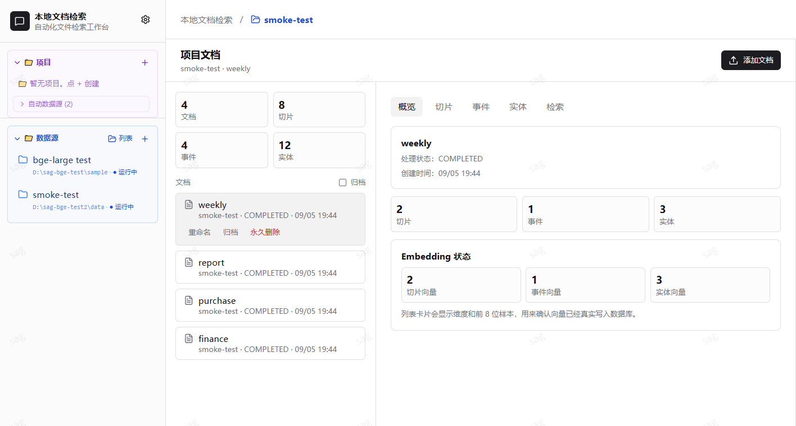
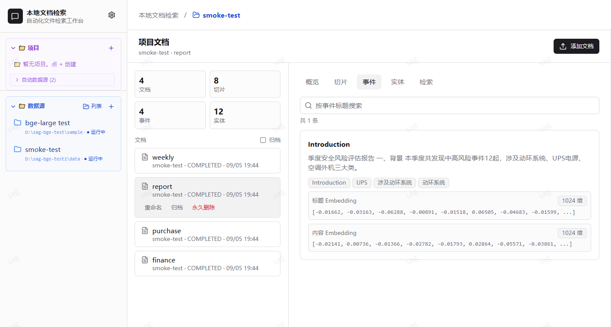
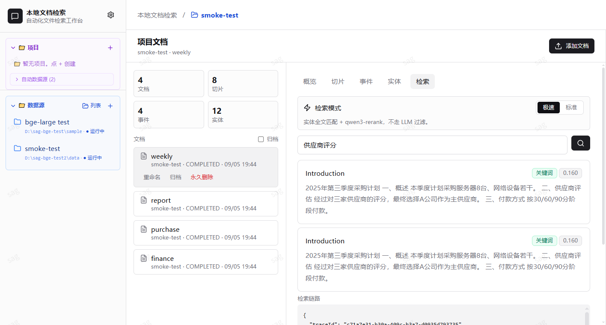

<p align="center">
  
</p>

# Local Folder Knowledge Base

**Language**: [简体中文](README.md) | English

> Vectorize any local folder into a personal knowledge base you can chat with, search, and visualize.

Point it at one or more local folders and it automatically chunks, embeds, extracts events, pulls out entities, and organizes their relations. After that you can ask questions in natural language, watch the retrieval process, browse the knowledge graph, and expose the whole knowledge base as an MCP service to external Agents.

> This project is a fork of [Zleap-AI/SAG](https://github.com/Zleap-AI/SAG). The core retrieval structure (chunk → event → entities with multi-hop recall) comes from upstream. This repository adds local-first and offline-friendly changes on top of it — see [Differences from upstream](#differences-from-upstream).



---

## What it does

Turn an ordinary folder into a knowledge base you can chat with. Typical use cases:

- **Personal knowledge base**: drop notes, web clippings, and Markdown files into a folder and search or ask questions across them.
- **Team document retrieval**: mount a project's documentation directory and share one retrieval service across the team.
- **RAG / Agent prototyping**: includes an MCP Server — an external Agent can call into the current knowledge base with a single config block.
- **Retrieval-process debugging**: every recall and score is shown in the right-hand panel for tuning.

---

## Core features

- **Local folder as data source**: point it at a directory (with optional file-type whitelist), and new/modified/deleted files are picked up incrementally.
- **Multiple data sources per project**: one project can mount several local folders as "auto data sources". Newly added or modified documents are attributed to their owning project based on file / directory ownership, and cross-directory retrieval results are presented uniformly under the same project.
- **Structured knowledge**: each chunk is reduced to one complete event plus a set of entities. Events keep the full semantics; entities carry the indexing and relation expansion.
- **Multi-hop recall**: retrieval starts from an event and can hop along entity relations, avoiding the cost of rebuilding a heavyweight knowledge graph.
- **Multiple retrieval strategies**: switchable — BM25 / vector / multi-route (event + entity recall with LLM rerank).
- **Local embedding**: works out of the box with `Xenova/bge-large-zh-v1.5` (int8 quantized, ~312 MB, 1024 dims) — no API key required.
- **Cloud embedding**: also supports any OpenAI-compatible Embedding API.
- **MCP integration**: each project has its own MCP config; external Agents can call `sag_search` / `sag_ingest_document` etc. directly.
- **Visualization**: retrieval trace + knowledge graph (event / entity nodes, drag and zoom) on the right.
- **Local-first**: SQLite + sqlite-vec. The whole deployment is one `.db` file plus a few scripts — backup = copy.

---

## Workspace preview

### Project documents / overview

After creating a project and mounting a local folder, the project page shows document / chunk / event / entity counts, each document's processing status, and a sample of each embedding (first 8 dimensions — useful to confirm vectors are actually written).


### Events and entities

On a single document's "Events" tab you can see the structured extraction result: event title, linked entity tags, and samples of the title embedding and content embedding (default 1024 dims).



### Conversational retrieval

The "Search" page lets you ask questions directly against the current project, with both Fast and Standard modes. The result area shows hits, scores, and match types; the lower area streams the retrieval trace in real time (queryEntities / expandedEventIds / coarseRankedEvents etc.) for debugging.



---

## Quick start

### 1. Requirements

- Node.js 20+
- npm

> PostgreSQL / pgvector are no longer required — this project uses SQLite + sqlite-vec by default.

### 2. Clone and configure

```bash
git clone https://github.com/13411978991/doc_vectorizer.git
cd doc_vectorizer
cp .env.example .env
```

`.env.example` already includes sensible defaults. To use local Embedding you don't need to change anything; for cloud models, fill in `EMBEDDING_API_KEY` / `LLM_API_KEY`.

### 3. Install dependencies

```bash
npm install
```

> vitest may lack `@embedded-postgres/windows-x64` in some Windows environments. Install it separately if you need to run tests; the main app runs fine without it.

### 4. Start

```bash
# Development mode (Vite dev server + backend watch)
npm run dev

# Production mode
npm run build
npm start
```

Default ports:

- WebUI: <http://localhost:5173>
- HTTP API: <http://localhost:4173>

### 5. First-time usage

1. Open the WebUI.
2. Click "New Project" in the left sidebar.
3. Open the Documents panel and add a local folder as a data source (with optional whitelist / blacklist / recursive settings).
4. The system watches, syncs, and embeds automatically.
5. Switch to the Chat panel and ask your knowledge base a question.
6. The right-hand trace panel shows every recall and its latency.

### 6. One-click start scripts (Windows / macOS / Linux)

The repository root ships with:

- `start.bat` (Windows)
- `start.ps1` (Windows PowerShell)
- `start.sh` (macOS / Linux)

Double-click or run one and it builds + starts automatically, without blocking the console window.

---

## Connecting an embedding model

Three ways, in recommended order:

### Option 1: local BGE (recommended, zero config)

The download script pulls `Xenova/bge-large-zh-v1.5` (int8 quantized, 1024 dims, ~312 MB) from ModelScope into `./models/bge-large-zh-v1.5`:

```bash
./scripts/download-bge-model.sh
```

After starting, in WebUI → Settings → AI Provider:

- Set Embedding provider to **`local-bge`**
- Set Local model path to the directory printed by the script

The first switch loads the ONNX pipeline (a few seconds). Afterwards each text is just a forward pass, around 30–150 ms / text.

> The DB schema locks 1024 dims, so you **must pick a model with `hidden_size = 1024`**. Community options: `Xenova/bge-large-zh-v1.5`, `Xenova/bge-m3`. The model directory must contain an `onnx/model_int8.onnx` (or `model.onnx`).
>
> Direct HuggingFace access may not be reachable from certain networks; use the ModelScope mirror.

### Option 2: OpenAI-compatible cloud API

Fill in `.env`:

```env
EMBEDDING_BASE_URL=https://api.your-provider.com/v1
EMBEDDING_MODEL=text-embedding-3-large
EMBEDDING_DIMENSIONS=1024
EMBEDDING_API_KEY=your_key
```

The WebUI settings panel shows "configured / not configured" only — the key is never echoed back in plain text.

### Option 3: key-less local fallback

If you configure nothing, the system uses a deterministic local fallback. **This is only there to let the UI walk through the flow** — retrieval quality is not usable. For real use, go with option 1 or 2.

---

## MCP integration

Each project has its own MCP config. An external Agent plugs in with a single block:

```json
{
  "mcpServers": {
    "doc_vectorizer": {
      "command": "npm",
      "args": ["run", "mcp"],
      "env": {
        "SAG_MCP_SOURCE_ID": "current_project_id"
      }
    }
  }
}
```

Built-in tools:

| Tool | Purpose |
|---|---|
| `sag_ingest_document` | Import a document: chunking + event extraction + entity extraction + embedding |
| `sag_search` | Run multi-route retrieval against the current project; returns results + internal trace |
| `sag_explain_search` | Return an explanation of the current project's retrieval pipeline and trace |
| `sag_get_event` | Look up an event by its ID |

---

## Retrieval strategies

Two pipelines you can switch between:

- **Fast mode**: BM25 / full-text + SAG multi-hop recall + `qwen3-rerank` to pick top-K. **Does not call the LLM to extract query entities** — fastest.
- **Standard mode**: LLM extracts query entities → SAG multi-route recall → LLM rerank. Higher precision; useful for comparison with fast mode.

Both modes are more accurate than plain vector search, because both lean on the event / entity indexes and SQL multi-hop expansion.

Request example:

```bash
curl -X POST http://localhost:4173/api/search \
  -H 'Content-Type: application/json' \
  -d '{"query":"vendor scoring","sourceIds":["<project_id>"],"strategy":"multi","searchMode":"fast","topK":5,"returnTrace":true}'
```

Streaming trace:

```bash
curl -N -X POST http://localhost:4173/api/search/stream \
  -H 'Content-Type: application/json' \
  -d '{"query":"..."}],"sourceIds":["<project_id>"],"strategy":"multi","returnTrace":true}'
```

---

## Project structure

```text
src/
  ai/                 Embedding / LLM / Rerank clients
  api/                HTTP API routes
  config/             Environment configuration
  db/                 SQLite connection, migrations, repositories, sqlite-vec
  mcp/                MCP Server
  observability/      Logging, model-call records
  services/           Document processing, retrieval, graph, WebUI service
  watcher/            Folder watching / sync / manifest
  audit/              (Optional) process-archive capability; see docs/audit-task-redesign/

web/
  src/                React WebUI (Vite + Tailwind)

docs/
  assets/             README screenshots and diagrams
  audit-task-redesign/  (Optional) process-archive design notes
```

---

## Common commands

```bash
npm run typecheck     # Type-check
npm run lint          # Static checks (errors only block; warnings can be kept)
npm run build         # Produce dist/
npm start             # Run the production bundle
npm run dev           # Development mode
npm run mcp           # Run the MCP stdio server
```

---

## Differences from upstream

This project is a fork of [Zleap-AI/SAG](https://github.com/Zleap-AI/SAG). The core differences (handy for cherry-picking / diffing):

- **Storage**: SQLite + sqlite-vec replaces PostgreSQL + pgvector — the whole database is a single `.db` file you can copy.
- **Embedding**: ships a `local-bge` provider that mounts a local ONNX model directly; no remote API required.
- **Data sources**: folder watching, incremental sync, manifests, and file-type whitelist / blacklist are all strengthened on top of upstream.
- **Operating model**: upstream defaults to PostgreSQL + cloud LLM; this repo defaults to SQLite + offline embedding — single-machine ready out of the box.
- **Optional capability**: the `src/audit/` directory and `docs/audit-task-redesign/` folder preserve "process archive" extensions (shared-folder scanner, AI procedure extraction, Timeline records, inline SVG flowcharts, etc.). These areas are isolated from upstream and can be dropped entirely to fall back to a clean SAG.

Conflict surface is concentrated in `src/audit/` and `docs/audit-task-redesign/`; other directories evolve in step with upstream.

---

## FAQ

### Port already in use

Edit `.env`:

```env
HTTP_PORT=4173
```

5173 is Vite's dev port — it auto-picks a free port if taken.

### First-time embedding load is slow

That's normal — `local-bge` loads the ONNX pipeline (~2 GB transient memory) the first time you switch to it. After that it's just forward passes per text.

### Document processing is slow

Depends on file count, chunk count, and embedding latency. Tune `.env`:

```env
INGEST_CONCURRENCY=5
```

### vec0 table returns no rows / vector recall returns 0

The chunk's embedding is currently stored in `chunk_embeddings.embedding_json` (TEXT); the `chunk_vec0` virtual table's writer is not yet implemented, so the KNN index is empty. **Recall currently runs on BM25 / full-text matching plus a JS-side cosine fallback** — it still hits, just not via vec0 KNN. See the comments in `src/db/repositories.ts`.

### MCP tools do not appear

Open the MCP panel inside the project and confirm the config has been generated. When an external Agent connects via stdio, make sure `SAG_MCP_SOURCE_ID` is set to the current project's ID.

---

## License

MIT License. See [LICENSE](LICENSE).